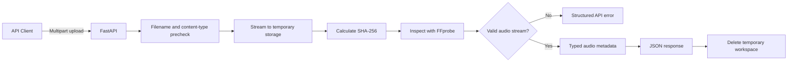
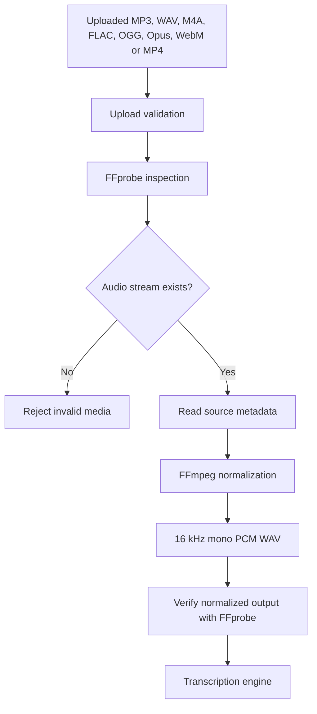
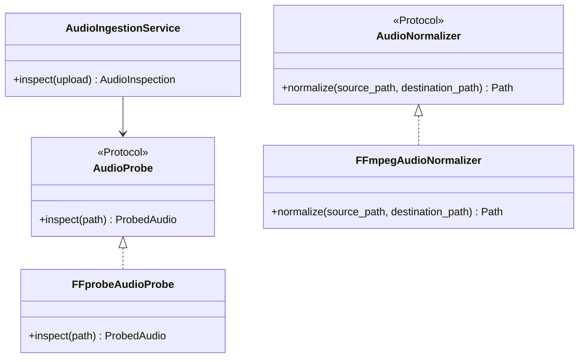
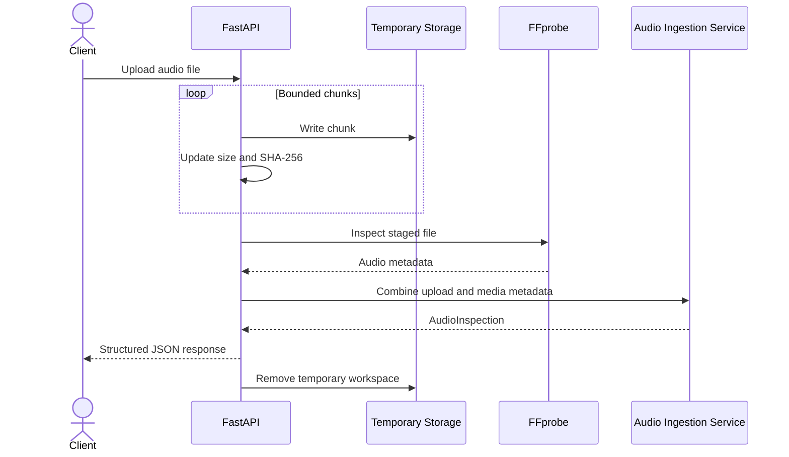
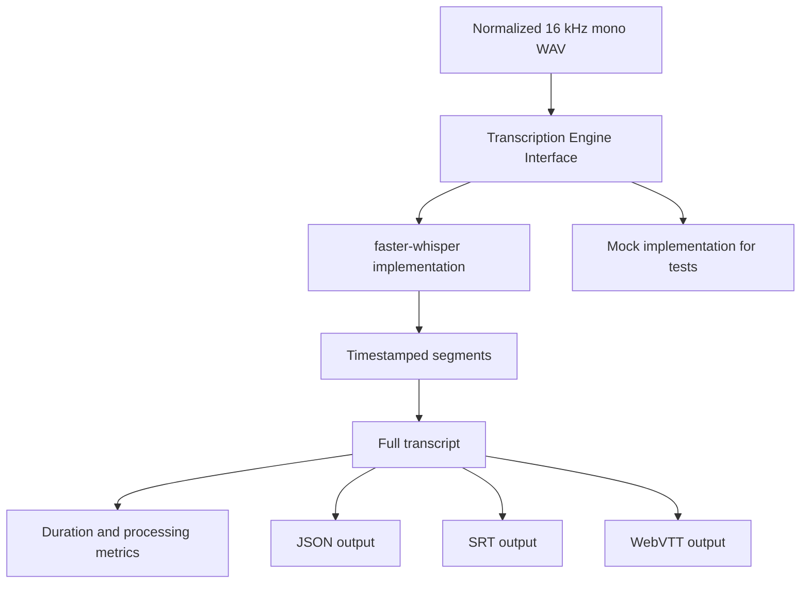

# Speech Transcription Service

A speech-to-text backend that accepts common audio formats, validates the actual
media stream, normalizes audio for transcription, and returns structured metadata
for downstream processing.

The implementation is intentionally small enough to run locally, but the boundaries
between the API, application logic, media tooling, and transcription engine are kept
separate so the service can evolve without rewriting the whole pipeline.

## Current implementation

The service currently supports:

- FastAPI application factory and versioned API routes
- Environment-based configuration
- Liveness and readiness probes
- Multipart audio uploads
- Bounded upload streaming
- Upload-size enforcement during streaming
- SHA-256 calculation
- Extension and content-type prechecks
- Real media validation with FFprobe
- FFmpeg normalization to 16 kHz mono PCM WAV
- Structured application errors
- Unit and integration tests
- Docker configuration

Transcription and timestamp generation are the next implementation stage.

## Implemented request flow



The filename and content type are used for fast rejection only. FFprobe validates
the contents of the uploaded file and remains the source of truth.

## Media boundary



The normalized format is the internal contract for the future transcription engine:

| Property | Value |
|---|---|
| Container | WAV |
| Codec | PCM signed 16-bit little-endian |
| Sample rate | 16 kHz |
| Channels | Mono |

Keeping one internal format means the transcription layer does not need separate
logic for every input container or codec.

## Component boundaries



FFmpeg and FFprobe are infrastructure details. The application layer depends on
protocols rather than subprocess implementations, which keeps tests deterministic
and allows those implementations to be replaced later.

## Audio inspection API

### Endpoint

```http
POST /api/v1/audio/inspect
Content-Type: multipart/form-data
```

### cURL example

```bash
curl -X POST \
  http://127.0.0.1:8000/api/v1/audio/inspect \
  -F "file=@sample.mp3"
```

### Example response

```json
{
  "filename": "sample.mp3",
  "content_type": "audio/mpeg",
  "size_bytes": 4363373,
  "sha256": "08f33db9ade423eefb7501a09f27e0711968fa77b015ec92d8684396b8ef2a49",
  "container_format": "mp3",
  "duration_seconds": 181.764,
  "codec_name": "mp3",
  "sample_rate_hz": 48000,
  "channels": 2,
  "channel_layout": "stereo",
  "bit_rate_bps": 192000
}
```

## Upload lifecycle



The service does not read the complete upload into a single in-memory byte array.
The configured size limit is enforced while the request body is consumed.

## Structured errors

Application failures are represented with stable error codes.

```json
{
  "error": {
    "code": "INVALID_AUDIO",
    "message": "The uploaded file could not be validated as audio."
  }
}
```

Current error categories include:

| Code | Meaning |
|---|---|
| `EMPTY_FILE` | The uploaded file contains no bytes |
| `FILE_TOO_LARGE` | The configured upload limit was exceeded |
| `UNSUPPORTED_MEDIA_TYPE` | Extension or declared content type is unsupported |
| `INVALID_AUDIO` | FFprobe could not find a valid audio stream |
| `MEDIA_DEPENDENCY_UNAVAILABLE` | FFmpeg or FFprobe is not available |
| `MEDIA_INSPECTION_TIMEOUT` | FFprobe exceeded its timeout |
| `AUDIO_NORMALIZATION_TIMEOUT` | FFmpeg exceeded its timeout |
| `AUDIO_NORMALIZATION_FAILED` | FFmpeg could not produce normalized audio |

Raw subprocess errors are not returned to clients.

## Requirements

- Python 3.11 or newer
- FFmpeg and FFprobe
- Docker Desktop, optional

Verify the media tools:

```bash
ffmpeg -version
ffprobe -version
```

## Local setup

### Windows PowerShell

```powershell
py -3.11 -m venv .venv
.venv\Scripts\Activate.ps1
python -m pip install --upgrade pip
pip install -e ".[dev]"
Copy-Item .env.example .env
```

### Linux or macOS

```bash
python3.11 -m venv .venv
source .venv/bin/activate
python -m pip install --upgrade pip
pip install -e ".[dev]"
cp .env.example .env
```

Start the API:

```bash
python -m uvicorn speech_transcription_service.main:app --reload
```

Open:

- Swagger UI: `http://localhost:8000/docs`
- ReDoc: `http://localhost:8000/redoc`
- Liveness: `http://localhost:8000/api/v1/health/live`
- Readiness: `http://localhost:8000/api/v1/health/ready`

## Tests and quality checks

Run the complete suite:

```bash
pytest
ruff check .
ruff format --check .
mypy
```

Run only the media integration tests:

```bash
pytest tests/integration -v
```

The integration suite executes the real FFmpeg and FFprobe binaries. Test audio is
generated programmatically, so binary fixtures are not stored in the repository.

Run coverage:

```bash
pytest \
  --cov=speech_transcription_service \
  --cov-report=term-missing
```

## Docker

Docker is an optional execution method.

```bash
docker compose up --build
```

Check the service:

```bash
curl http://localhost:8000/api/v1/health/live
```

Stop it:

```bash
docker compose down
```

The Docker configuration includes FFmpeg as a runtime dependency. Container execution
will be verified before the first release.

## Next stage



The next stage will add a replaceable transcription engine, timestamped segments,
model lifecycle management, and deterministic tests that do not require loading a
speech model during every test run.