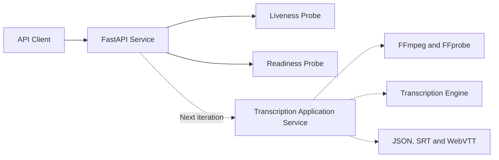
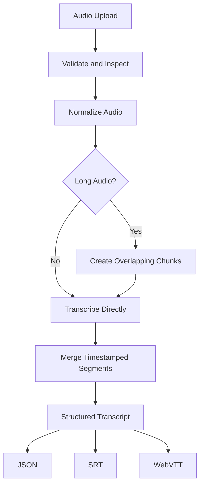

# Speech Transcription Service

A production-minded speech-to-text backend for converting audio into structured
transcripts with segment-level timestamps.

The project is being developed as a small but production-shaped system. The local
implementation remains easy to run, while the internal boundaries are designed to
support background processing, long-audio workflows, multiple transcription engines,
and downstream export formats.

## Current status

The repository currently contains the service foundation:

- FastAPI application factory
- Environment-based configuration
- Versioned API prefix
- Liveness and readiness probes
- Automated API tests
- Docker and Docker Compose setup

Audio ingestion and transcription will be added in subsequent iterations.

## Architecture direction



Solid arrows represent functionality currently implemented. Dashed arrows represent
components planned for the next development stages.

## Requirements

- Python 3.11 or newer
- Docker Desktop, optional

## Local setup

Create and activate a virtual environment.

### Windows PowerShell

```powershell
py -3.12 -m venv .venv
.venv\Scripts\Activate.ps1
python -m pip install --upgrade pip
pip install -e ".[dev]"
Copy-Item .env.example .env
```

### Linux or macOS

```bash
python3.12 -m venv .venv
source .venv/bin/activate
python -m pip install --upgrade pip
pip install -e ".[dev]"
cp .env.example .env
```

Start the API:

```bash
python -m uvicorn speech_transcription_service.main:app --reload
```

Open:

- Swagger UI: `http://localhost:8000/docs`
- ReDoc: `http://localhost:8000/redoc`
- Liveness: `http://localhost:8000/api/v1/health/live`
- Readiness: `http://localhost:8000/api/v1/health/ready`

## Tests and quality checks

```bash
pytest
ruff check .
ruff format --check .
mypy
```

Run tests with coverage:

```bash
pytest --cov=speech_transcription_service --cov-report=term-missing
```

## Docker

Build and start the service:

```bash
docker compose up --build
```

Check the service:

```bash
curl http://localhost:8000/api/v1/health/live
```

Stop it:

```bash
docker compose down
```

## Planned capabilities



The diagrams will evolve with the implementation. They are intended to describe actual
behavior and explicitly identified production recommendations, not components that have
not been built.