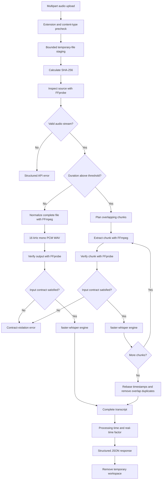
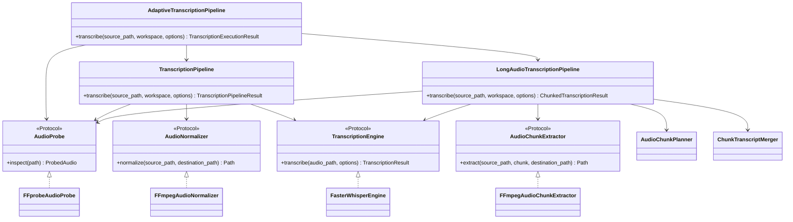
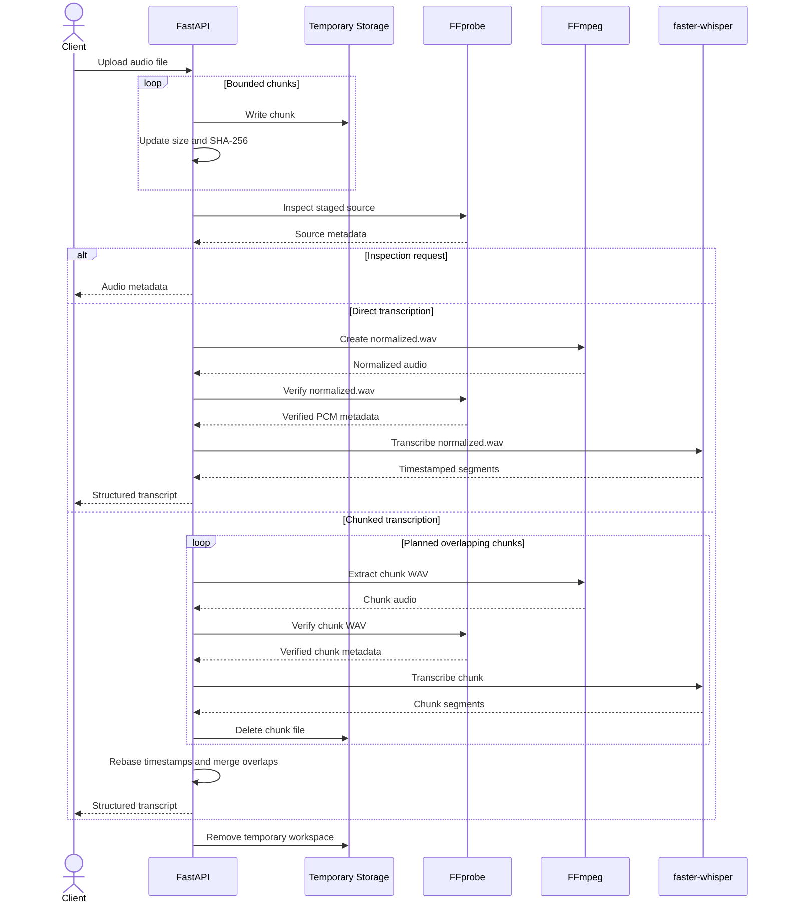
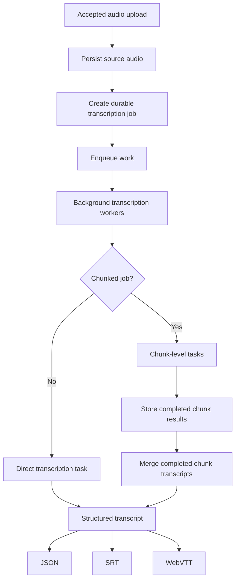

# Speech Transcription Service

A production-minded speech-to-text backend that accepts common audio formats,
validates the actual media stream, normalizes audio into a stable internal format,
and returns transcripts with segment-level timestamps.

The implementation remains straightforward to run locally, while the boundaries
between the API, application workflow, media tooling, chunking logic, and
transcription engine are kept separate. This allows the service to evolve toward
background workers, multiple transcription engines, persistent jobs, additional
export formats, and production storage without replacing the core pipeline.

## Current implementation

The service currently supports:

- FastAPI application factory and versioned API routes
- Environment-based configuration
- Liveness and readiness probes
- Multipart audio uploads
- Bounded upload streaming and upload-size enforcement
- SHA-256 calculation during upload
- Extension and content-type prechecks
- Real media inspection with FFprobe
- FFmpeg normalization to 16 kHz mono PCM WAV
- Verification of normalized audio before inference
- Automatic direct-versus-chunked transcription selection by source duration
- Long-audio chunk planning with configurable chunk duration and overlap
- FFmpeg chunk extraction into the same verified internal audio format
- Deterministic overlap ownership, timestamp rebasing, and merged segment indexes
- A replaceable transcription-engine interface
- A faster-whisper engine with lazy, thread-safe model loading
- Automatic language detection or an explicit language hint
- Segment-level timestamps
- Optional word-level timestamps
- Processing-duration and real-time-factor metrics
- Response metadata for transcription mode and chunk count
- Structured application errors
- Unit, API, adapter, pipeline, and media integration tests
- Docker and Docker Compose configuration

The transcription endpoint is synchronous. Audio up to the configured threshold is
normalized and transcribed directly. Audio above that threshold is processed
sequentially in overlapping chunks, then merged back into one timestamped transcript.

The production design for concurrent uploads, persistent jobs, worker recovery,
storage, and retries will be documented separately from the functionality implemented
in this repository.

## Implemented request flow

```mermaid
flowchart LR
    Client[API Client] -->|Multipart upload| API[FastAPI]

    API --> Precheck[Filename and content-type precheck]
    Precheck --> Stage[Stream to temporary storage]
    Stage --> Hash[Calculate SHA-256]
    Hash --> Probe[Inspect source with FFprobe]

    Probe --> Decision{Valid audio stream?}
    Decision -->|No| Error[Structured API error]
    Decision -->|Yes| Route{Requested operation}

    Route -->|Inspect| Metadata[Return source metadata]
    Route -->|Transcribe| Selector{Duration above chunk threshold?}

    Selector -->|No| Normalize[Normalize complete file with FFmpeg]
    Normalize --> Verify[Verify normalized audio]
    Verify --> Whisper[faster-whisper]
    Whisper --> Segments[Timestamped segments]

    Selector -->|Yes| Plan[Plan overlapping chunks]
    Plan --> Extract[Extract verified WAV chunks]
    Extract --> ChunkWhisper[Transcribe chunks sequentially]
    ChunkWhisper --> Merge[Rebase timestamps and merge overlaps]

    Segments --> Response[Structured transcript response]
    Merge --> Response

    Metadata --> Cleanup[Delete temporary workspace]
    Response --> Cleanup
```



The filename extension and client-provided content type are used only for inexpensive
early rejection. FFprobe validates the actual media stream and remains the source of
truth.

## Implemented transcription pipeline



Every accepted source format is converted to one internal transcription format:

| Property | Value |
|---|---|
| Container | WAV |
| Codec | PCM signed 16-bit little-endian |
| Sample rate | 16 kHz |
| Channels | Mono |

Keeping one internal representation means the transcription engine does not need
separate code paths for MP3, WAV, M4A, FLAC, OGG, Opus, WebM, or MP4 inputs.

The normalized output is inspected again before inference. The service therefore
does not assume that a successful FFmpeg process automatically produced the expected
transcription input.

For audio longer than the configured threshold, the service extracts overlapping WAV
chunks instead of creating one complete normalized file. Each chunk is verified
against the same internal audio contract before inference.

Overlap handling is deterministic. The midpoint between overlapping windows defines
which chunk owns a segment. Segment and word timestamps are rebased from chunk-local
time to full-audio time, duplicate overlap segments are removed, and final segment
indexes are assigned in chronological order.

## Component boundaries



FFmpeg, FFprobe, and faster-whisper remain infrastructure details.

The application pipelines depend on protocols and stable domain models rather than
third-party objects. Tests can therefore inject deterministic implementations without
starting subprocesses or loading a speech model.

## Upload lifecycle



The service does not read the complete upload into a single Python `bytes` object.
The configured size limit is enforced while the request body is consumed.

Temporary source, normalized, and chunk files exist only for the duration of the
request and are removed after either success or failure.

## Supported input extensions

The current upload precheck accepts:

- `.aac`
- `.flac`
- `.m4a`
- `.mp3`
- `.mp4`
- `.ogg`
- `.opus`
- `.wav`
- `.webm`
- `.wma`

An accepted extension does not guarantee acceptance of the file. FFprobe must still
identify a valid audio stream.

Generic `application/octet-stream` uploads are permitted because some clients cannot
determine a reliable MIME type. The media contents are still validated before they
reach the transcription engine.

## Audio inspection API

### Endpoint

```http
POST /api/v1/audio/inspect
Content-Type: multipart/form-data
```

The inspection endpoint validates an upload and returns metadata for the original
source file. It does not perform transcription.

### cURL example

```bash
curl -X POST \
  http://127.0.0.1:8000/api/v1/audio/inspect \
  -F "file=@sample.mp3;type=audio/mpeg"
```

### Example response

```json
{
  "filename": "sample.mp3",
  "content_type": "audio/mpeg",
  "size_bytes": 4363373,
  "sha256": "08f33db9ade423eefb7501a09f27e0711968fa77b015ec92d8684396b8ef2a49",
  "container_format": "mp3",
  "duration_seconds": 181.764,
  "codec_name": "mp3",
  "sample_rate_hz": 48000,
  "channels": 2,
  "channel_layout": "stereo",
  "bit_rate_bps": 192000
}
```

## Transcription API

### Endpoint

```http
POST /api/v1/transcriptions
Content-Type: multipart/form-data
```

### Form fields

| Field | Required | Default | Description |
|---|---:|---:|---|
| `file` | Yes | Required | Audio file to transcribe |
| `language` | No | Auto-detect | Spoken-language code such as `en` |
| `beam_size` | No | `5` | Beam-search size from 1 to 20 |
| `vad_filter` | No | `true` | Apply voice-activity detection |
| `word_timestamps` | No | `false` | Include timestamps for individual words |

### cURL example

```bash
curl -X POST \
  http://127.0.0.1:8000/api/v1/transcriptions \
  -F "file=@sample.mp3;type=audio/mpeg" \
  -F "beam_size=3" \
  -F "vad_filter=true" \
  -F "word_timestamps=false"
```

### Example response

```json
{
  "upload": {
    "filename": "sample.mp3",
    "content_type": "audio/mpeg",
    "size_bytes": 321197,
    "sha256": "9ffbdc9defc6722ac372cc3422a74d2ba716e141566900ea58b5f1479b46908d"
  },
  "source_audio": {
    "container_format": "mp3",
    "duration_seconds": 20.0,
    "codec_name": "mp3",
    "sample_rate_hz": 48000,
    "channels": 2,
    "channel_layout": "stereo",
    "bit_rate_bps": 128000
  },
  "normalized_audio": {
    "container_format": "wav",
    "duration_seconds": 20.0,
    "codec_name": "pcm_s16le",
    "sample_rate_hz": 16000,
    "channels": 1,
    "channel_layout": null,
    "bit_rate_bps": 256000
  },
  "transcript": {
    "text": "Complete transcript text.",
    "language": "en",
    "language_probability": 0.8489,
    "duration_seconds": 20.0,
    "segments": [
      {
        "index": 0,
        "start_seconds": 1.42,
        "end_seconds": 6.42,
        "text": "First timestamped segment.",
        "words": []
      }
    ],
    "model_name": "small",
    "processing_seconds": 8.53
  },
  "mode": "direct",
  "chunk_count": 1,
  "real_time_factor": 0.426
}
```

For direct transcription, `normalized_audio` contains metadata for the complete
normalized WAV file.

For chunked transcription, `normalized_audio` is `null` because the service creates
temporary verified chunk files instead of one complete normalized file. The response
then includes `"mode": "chunked"` and `chunk_count` reports how many chunks were
processed.

### Segment timestamps

Each segment includes:

- zero-based segment index
- start time in seconds
- end time in seconds
- normalized segment text
- optional word-level results

When `word_timestamps=false`, the `words` array remains empty.

When `word_timestamps=true`, each word may include:

```json
{
  "start_seconds": 0.0,
  "end_seconds": 0.4,
  "text": "Hello",
  "probability": 0.97
}
```

## Processing metrics

For direct transcription, `processing_seconds` measures:

- transcription inference
- complete iteration over faster-whisper's lazy segment result
- conversion into the service's internal transcript models

For chunked transcription, `processing_seconds` is the sum of the per-chunk
transcription inference times after timestamp rebasing and overlap merging.

It does not include:

- file upload time
- model downloading
- lazy model initialization
- FFprobe inspection
- FFmpeg normalization or chunk extraction

The real-time factor is calculated as:

```text
processing seconds / audio duration
```

A value below `1.0` means transcription completed faster than the audio playback
duration.

For example:

```text
8.53 seconds processing / 20.0 seconds audio = 0.426 RTF
```

This is equivalent to processing the audio at approximately 2.35 times real-time
playback speed.

## Model lifecycle

The faster-whisper model is loaded lazily.

Starting the FastAPI application does not immediately download or initialize model
weights. The first transcription request triggers model initialization.

Model construction uses a lock so concurrent first requests do not each initialize a
separate model instance.

After successful initialization, the same model object is reused for subsequent
requests handled by that application process.

The default configuration is:

| Setting | Default |
|---|---|
| Model | `small` |
| Device | `cpu` |
| Compute type | `int8` |
| CPU threads | Runtime default |
| Model workers | `1` |
| Language | Auto-detect |
| Direct transcription threshold | `600` seconds |
| Chunk duration | `300` seconds |
| Chunk overlap | `5` seconds |

These values can be overridden through environment variables.

## Structured errors

Application failures use stable error codes:

```json
{
  "error": {
    "code": "INVALID_AUDIO",
    "message": "The uploaded file could not be validated as audio."
  }
}
```

Current error categories include:

| Code | HTTP status | Meaning |
|---|---:|---|
| `EMPTY_FILE` | 400 | The uploaded file contains no bytes |
| `FILE_TOO_LARGE` | 413 | The configured upload limit was exceeded |
| `UNSUPPORTED_MEDIA_TYPE` | 415 | The extension or declared content type is unsupported |
| `INVALID_AUDIO` | 422 | FFprobe could not validate an audio stream |
| `MEDIA_DEPENDENCY_UNAVAILABLE` | 503 | FFmpeg or FFprobe is unavailable |
| `MEDIA_INSPECTION_TIMEOUT` | 504 | FFprobe exceeded its timeout |
| `MEDIA_INSPECTION_FAILED` | 500 | Media metadata could not be inspected |
| `AUDIO_NORMALIZATION_TIMEOUT` | 504 | FFmpeg exceeded its timeout |
| `AUDIO_NORMALIZATION_FAILED` | 500 | FFmpeg could not produce normalized audio |
| `AUDIO_CHUNK_EXTRACTION_TIMEOUT` | 504 | FFmpeg exceeded its timeout while extracting a chunk |
| `AUDIO_CHUNK_EXTRACTION_FAILED` | 500 | FFmpeg could not extract a requested audio chunk |
| `NORMALIZED_AUDIO_CONTRACT_VIOLATION` | 500 | Normalized audio failed verification |
| `TRANSCRIPTION_DEPENDENCY_UNAVAILABLE` | 503 | The model or engine could not be loaded |
| `TRANSCRIPTION_FAILED` | 500 | Inference or transcript conversion failed |

Raw subprocess errors, internal paths, and third-party exception details are not
returned to API clients.

## Manual end-to-end verification

The complete direct pipeline was manually verified on Windows using the multilingual
`small` model with CPU `int8` inference.

| Measurement | Result |
|---|---:|
| Source duration | 20.0 seconds |
| Source format | MP3, 48 kHz, stereo |
| Normalized format | WAV, PCM 16-bit, 16 kHz, mono |
| Detected language | English |
| Timestamped segments | 4 |
| Inference time | 8.53 seconds |
| Real-time factor | 0.426 |

The test confirmed:

- source metadata inspection
- MP3 decoding
- stereo-to-mono conversion
- 48 kHz to 16 kHz resampling
- normalized-output verification
- automatic language detection
- segment-level timestamp generation
- ordered transcript assembly
- temporary-file cleanup

This benchmark describes one local machine and is not presented as a general
performance guarantee.

The first request can take longer when model files have not yet been downloaded or
initialized.

## Requirements

- Python 3.11 or newer
- FFmpeg
- FFprobe
- Internet access for the first named-model download, unless the model is already cached
- Docker Desktop, optional

Verify the media tools:

```bash
ffmpeg -version
ffprobe -version
```

## Local setup

### Windows PowerShell

Create and activate a virtual environment:

```powershell
py -3.11 -m venv .venv
.venv\Scripts\Activate.ps1
python -m pip install --upgrade pip
pip install -e ".[dev]"
Copy-Item .env.example .env
```

PowerShell may block script activation depending on the local execution policy. A
process-scoped policy can be used without changing the machine-wide setting:

```powershell
Set-ExecutionPolicy `
  -Scope Process `
  -ExecutionPolicy RemoteSigned
```

### Linux or macOS

```bash
python3.11 -m venv .venv
source .venv/bin/activate
python -m pip install --upgrade pip
pip install -e ".[dev]"
cp .env.example .env
```

## Configuration

Configuration values use the `STS_` environment-variable prefix.

Example:

```dotenv
STS_APP_NAME=Speech Transcription Service
STS_APP_VERSION=0.1.0
STS_ENVIRONMENT=local
STS_API_PREFIX=/api/v1
STS_DOCS_ENABLED=true

STS_MAX_UPLOAD_BYTES=104857600
STS_UPLOAD_CHUNK_BYTES=1048576

STS_FFPROBE_PATH=ffprobe
STS_FFPROBE_TIMEOUT_SECONDS=30

STS_FFMPEG_PATH=ffmpeg
STS_FFMPEG_TIMEOUT_SECONDS=300
STS_NORMALIZED_SAMPLE_RATE_HZ=16000
STS_NORMALIZED_CHANNELS=1

STS_TRANSCRIPTION_MODEL_NAME=small
STS_TRANSCRIPTION_DEVICE=cpu
STS_TRANSCRIPTION_COMPUTE_TYPE=int8
STS_TRANSCRIPTION_CPU_THREADS=0
STS_TRANSCRIPTION_NUM_WORKERS=1
STS_TRANSCRIPTION_LOCAL_FILES_ONLY=false
STS_TRANSCRIPTION_CHUNKING_THRESHOLD_SECONDS=600
STS_TRANSCRIPTION_CHUNK_DURATION_SECONDS=300
STS_TRANSCRIPTION_CHUNK_OVERLAP_SECONDS=5
```

An optional model-cache directory can be configured:

```dotenv
STS_TRANSCRIPTION_DOWNLOAD_ROOT=C:\models\faster-whisper
```

For Linux:

```dotenv
STS_TRANSCRIPTION_DOWNLOAD_ROOT=/var/lib/speech-transcription/models
```

When `STS_TRANSCRIPTION_LOCAL_FILES_ONLY=true`, model initialization will not attempt
to download missing model files.

Long-audio chunking is controlled by:

| Setting | Default | Meaning |
|---|---:|---|
| `STS_TRANSCRIPTION_CHUNKING_THRESHOLD_SECONDS` | `600` | Audio at or below this duration uses the direct pipeline |
| `STS_TRANSCRIPTION_CHUNK_DURATION_SECONDS` | `300` | Raw duration of each extracted chunk |
| `STS_TRANSCRIPTION_CHUNK_OVERLAP_SECONDS` | `5` | Overlap between adjacent chunks for boundary safety |

The overlap must be less than the chunk duration. Invalid values fail during
application startup.

## Start the API

```bash
python -m uvicorn speech_transcription_service.main:app --reload
```

Open:

- Swagger UI: `http://localhost:8000/docs`
- ReDoc: `http://localhost:8000/redoc`
- Liveness: `http://localhost:8000/api/v1/health/live`
- Readiness: `http://localhost:8000/api/v1/health/ready`

Starting the API does not load the faster-whisper model. Model loading occurs on the
first transcription request.

## Tests and quality checks

Run the complete suite:

```bash
pytest
ruff check .
ruff format --check .
mypy
```

The current suite covers:

- health endpoints
- upload validation
- bounded staging
- SHA-256 calculation
- temporary-file cleanup
- structured API errors
- FFprobe integration
- FFmpeg integration
- FFmpeg chunk extraction
- chunk planning and overlap ownership
- timestamp rebasing and chunk transcript merging
- direct-versus-chunked transcription selection
- chunked transcription API orchestration
- transcription-pipeline ordering
- normalized-audio contract validation
- faster-whisper adapter behavior
- lazy model loading
- lazy segment consumption
- transcription API responses

Run only the media integration tests:

```bash
pytest tests/integration -v
```

The integration suite executes the installed FFmpeg and FFprobe binaries.

Test audio is generated programmatically, so binary media fixtures are not stored in
the repository.

Run the pipeline tests:

```bash
pytest tests/test_transcription_pipeline.py -v
pytest tests/test_long_audio_transcription_pipeline.py -v
pytest tests/test_adaptive_transcription_pipeline.py -v
```

Run the faster-whisper adapter tests:

```bash
pytest tests/test_faster_whisper_engine.py -v
```

Run the transcription API tests:

```bash
pytest tests/test_transcription_api.py -v
```

Run coverage:

```bash
pytest \
  --cov=speech_transcription_service \
  --cov-report=term-missing
```

The regular automated suite does not download or load a real speech model. Adapter
tests inject fake model factories and deterministic segment iterators.

## Docker

Docker is an optional execution method.

Build and start the service:

```bash
docker compose up --build
```

Check the service:

```bash
curl http://localhost:8000/api/v1/health/live
```

Stop it:

```bash
docker compose down
```

The Docker image includes FFmpeg as a runtime dependency.

Model files are not baked into the image. A production deployment should use a
persistent model cache or a pre-provisioned model directory rather than downloading
weights into an ephemeral container filesystem.

Container execution remains pending final verification.

## Current limitations

The current implementation is deliberately synchronous.

A request keeps one API execution path occupied while it:

- uploads the file
- inspects media
- normalizes or chunks audio
- runs transcription
- rebases and merges chunk timestamps when chunking is used
- serializes the result

This is acceptable for the assessment demonstration and local execution, but it is not
the final architecture for high concurrency or durable long-running jobs.

The current implementation also does not yet include:

- persistent transcription jobs
- resumable processing
- chunk-level checkpoints
- SRT export
- WebVTT export
- distributed workers
- shared object storage
- request authentication
- rate limiting
- production metrics and tracing

These are intentional next-stage concerns rather than hidden claims about the current
code.

## Next stage



The next implementation stage will focus on:

- persistent job records
- background workers
- retry and recovery behavior
- idempotent request handling
- object storage for source audio and generated outputs
- JSON, SRT, and WebVTT exporters
- API polling for job status and results

A separate system-design document will describe concurrent uploads, durable storage,
job state transitions, worker failures, retry policies, API polling, and operational
scaling.
